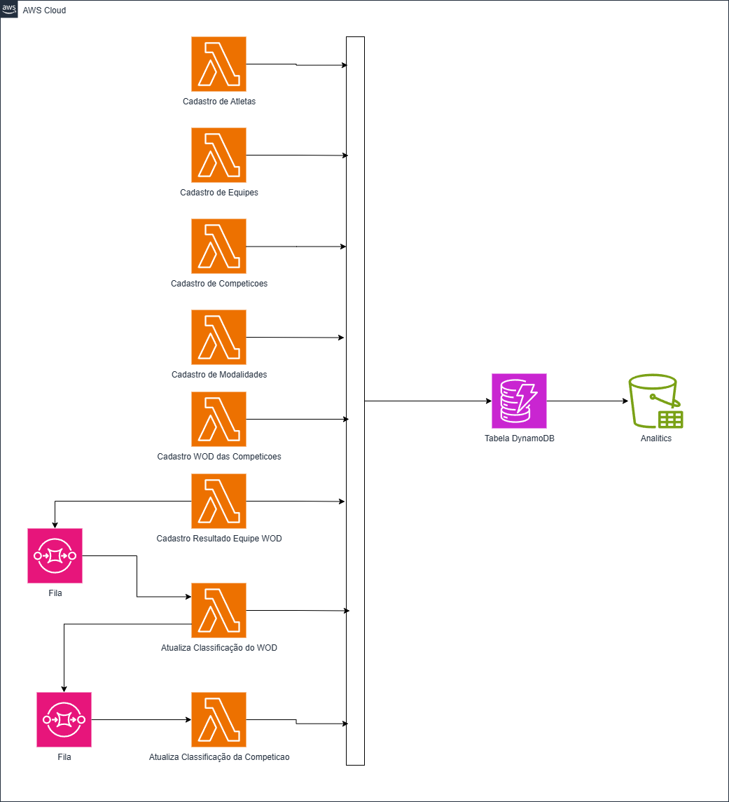

# Painel para competições de MMT

Projeto de estudos na AWS que visa construir uma plataforma de gerenciamento de competições de MMT.

## Objetivos da plataforma

- Cadastrar as competições
- Cadastrar as modaliddades das competições
- Cadastrar os WODs das modalidades das competições
- Cadastrar as equipes das modalidades das competições
- Cadastrar os atletas das equipes
- Cadastrar o resultado das equipes nos WODs das competições
- Calcular a pontuação das equipes nos WODs
- Calcular a pontuação das equipes nas modalidades

## Arquitetura da plataforma

- Construção na Cloud **AWS**
- Utilização de arquitetura de Microsserviços
- Utilização de componentes *serveless* da **AWS**
  - Computacional: AWS Lambdas
  - Banco de dados: AWS DynamoDB
  - Mensageria: AWS SQS
- Gestão de APIs: AWS API Gateway
- Linguagem de programação: Python

## Especificações

- Construção dos componentes na Cloud AWS utilizando IaaC. Linguagem adotada é o TERRAFORM.
- Utilização diretórios separados para cada componente a ser construído. O diretório deve estar organizado para conter a parte de Infraestrutura e a parte da Aplicação.
- Seguir as diretrizes do AWS Well-Architecture
- Cada elemento cadastral dos objetivos deve ser um microsserviço/lambda
- Cada elemento calulador dos objetivos deve ser acionado via evento
